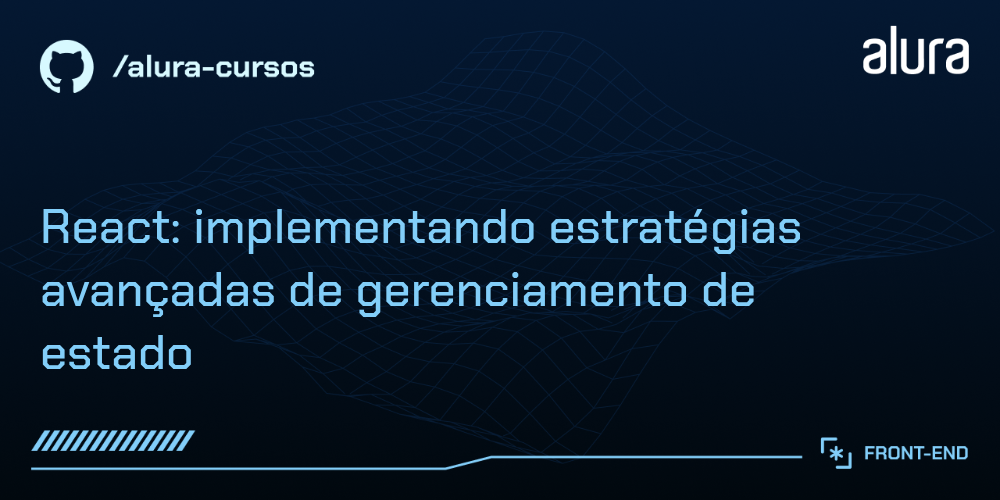

# Use Dev - Loja de Produtos para Desenvolvedores

Aplicação web desenvolvida em React para uma loja virtual especializada em produtos para desenvolvedores. O projeto permite navegar por produtos, gerenciar carrinho de compras e visualizar detalhes dos produtos.

## 🔨 Funcionalidades do projeto

A aplicação oferece as seguintes funcionalidades:

- **Catálogo de produtos**: Visualização de produtos em cards com imagem, nome, preço e cores disponíveis
- **Filtros de produtos**: Sistema de filtros por categoria, preço e ordenação
- **Carrinho de compras**: Adicionar, remover e gerenciar itens no carrinho
- **Detalhes do produto**: Página dedicada com informações completas do produto

## ✔️ Técnicas e tecnologias utilizadas

As principais tecnologias e bibliotecas utilizadas no projeto:

- `React 19`: Biblioteca principal para construção da interface
- `Vite`: Build tool e servidor de desenvolvimento rápido
- `TanStack Query`: Gerenciamento de estado para requisições HTTP e cache inteligente
- `Zustand`: Gerenciamento de estado global (carrinho e preferências)
- `React Router DOM`: Roteamento e navegação entre páginas
- `Zod`: Validação e parsing de schemas TypeScript-first
- `Axios`: Cliente HTTP para requisições à API
- `TypeScript`: Tipagem estática para JavaScript
- `JSON Server`: API mock para desenvolvimento
- `ESLint`: Linting e padronização de código
- `React Compiler (Babel)`: Otimizações de performance automáticas

## 🎯 Funcionalidades implementadas

### Sistema de Carrinho com Zustand
- Gerenciamento de estado global do carrinho
- Persistência de dados
- Adicionar e remover produtos
- Cálculo automático de totais

### TanStack Query
- Cache inteligente de requisições HTTP
- Invalidação e refetch automático
- Estados de loading e error tratados
- Queries para produtos e categorias
- Mutations para criação de produtos

### Sistema de Filtros
- Filtros por faixa de preço
- Ordenação de produtos
- Interface de diálogo para filtros
- Estado sincronizado com URL (search params)

### Validação de Formulários
- Mensagens de erro personalizadas
- Validação em tempo real

## 📁 Acesso ao projeto

Você pode acessar o código fonte do projeto neste repositório ou fazer o download/clone para sua máquina local.

## 🛠️ Abrir e rodar o projeto

Após baixar o projeto, siga os passos abaixo:

### Pré-requisitos
- Node.js (versão 18 ou superior)
- pnpm (gerenciador de pacotes)

### Instalação

1. **Clone o repositório** (se ainda não fez):
```bash
git clone <url-do-repositorio>
cd 5158-use-dev
```

2. **Instale as dependências**:
```bash
pnpm install
```

3. **Execute o servidor JSON (API mock)**:
```bash
pnpm run dev:api
```

4. **Em outro terminal, execute a aplicação**:
```bash
pnpm run dev
```

Ou execute tudo de uma vez:
```bash
pnpm run dev:all
```

5. **Acesse a aplicação**:
Abra seu navegador e vá para `http://localhost:5173`

### Scripts disponíveis

- `pnpm run dev` - Inicia o servidor de desenvolvimento
- `pnpm run dev:api` - Inicia o JSON Server (API mock)
- `pnpm run dev:all` - Inicia API e aplicação simultaneamente
- `pnpm run build` - Gera a build de produção
- `pnpm run preview` - Preview da build de produção
- `pnpm run lint` - Executa o linting do código

## 🌐 API

O projeto utiliza JSON Server para simular uma API REST. Os dados dos produtos e categorias ficam armazenados no arquivo `db.json` e a API roda na porta 3001.

**Endpoints disponíveis:**
- `GET /products` - Lista todos os produtos
- `GET /products?id=1` - Busca produto por ID
- `GET /categories` - Lista todas as categorias
- `POST /products` - Cria um novo produto

## 📚 Mais informações do curso

Este projeto foi desenvolvido como parte do curso da Alura sobre React com gerenciamento de estado moderno, abordando conceitos como:

- Gerenciamento de estado com TanStack Query e Zustand
- Validação de formulários com Zod
- Otimização de performance com React Compiler
- Design responsivo com Tailwind CSS
- Arquitetura escalável de aplicações React
- Boas práticas de TypeScript

Gostou do projeto e quer conhecer mais? Você pode acessar o curso da Alura que desenvolve este projeto!